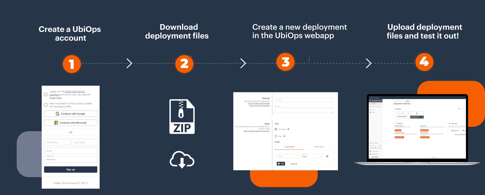
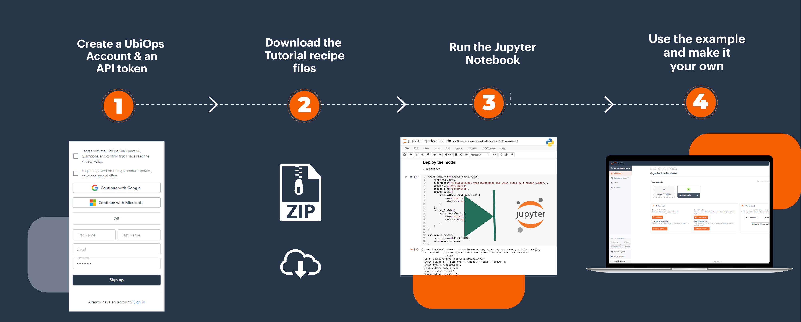

# Tutorials

Welcome to the UbiOps tutorials page!

The UbiOps tutorials page is here to provide (new) users with inspiration on how to work with UbiOps. Use it to find
inspiration or to discover new ways of working with the UbiOps platform.

With a (free) UbiOps account you can use the tutorials to have example applications running in your own environment
in minutes.*

## How does it work?

We have three tutorial categories:
All of our tutorials contain full walkthroughs that can be run in Jupyter notebook or Rstudio. Except for the UI tutorials, they
contain ready-to-go deployment packages which illustrate how to use the deployment package for typical cases, using the WebApp.

## Requirements

To be able to use the UbiOps tutorials you need three things:

- You need to have the UbiOps client library installed. For Python this can be done via pip install or via Setuptools. For more
information see our <a href="https://github.com/UbiOps/client-library-python" target="_blank">GitHub Python page</a>. For R this can be done by installing the devtools package and then using the install_github function. For more information see our <a href="https://github.com/UbiOps/client-library-r" target="_blank">GitHub R page</a> 

- If you want to run Python tutorials, you need to be able to run Jupyter Notebook. See the <a href="https://jupyter.org/install" target="_blank">installation guide</a>
  for more information.

- If you want to run R script tutorials, you need to be able to run Rstudio. See the <a href="https://docs.rstudio.com/installation/" target="_blank">installation guide</a> for more information.

- You need to have a UbiOps account. You can create a free account <a href="https://app.ubiops.com/sign-up" target="_blank">here</a>.

### UI tutorials

The UI tutorials show how to set up your deployment package for typical use cases. You can download the
deployment package, fill in the deployment creation form in the UI, and upload the deployment package. Afterwards
you can make a request to the deployment to test it out.

### Tutorials

Every *tutorial* contains a standalone example with all the material you need to run it. They are all centered around
a Jupyter Notebook. If you download the tutorial folder and run the notebook/script it will build the example in your own
UbiOps account.

## Our current Python Tutorials

| Topic and link to tutorial                                                                                                                                   | Functionalities of UbiOps addressed                                       |
|--------------------------------------------------------------------------------------------------------------------------------------------------------------|---------------------------------------------------------------------------|
| [Multiplying a number](ready-deployments/multiplication/multiplication.md)                                                                                   | UI, deployment                                                            |
| [Load & run a pre-trained model](ready-deployments/prediction-model/prediction-model.md)                                                                     | UI, training                                                              |
| [Image recognition](ready-deployments/image-recognition/image-recognition.md)                                                                                | UI, deployment                                                            |
| [GPU deployment](ready-deployments/gpu-tutorial/gpu-model.md)                                                                                                | UI, GPU instance types                                                    |
| [Creating a training and production pipeline with Scikit Learn in UbiOps](scikit-deployment/scikit-deployment.md)                                            | Deployments, pipelines                                                    |
| [Deploying a TensorFlow model in UbiOps](tensorflow-example/tensorflow-example.md)                                                                           | Deployments                                                               |
| [Deploying an XGBoost model in UbiOps](xgboost-deployment/xgboost-deployment.md)                                                                             | Deployments                                                               |
| [Inference speed of ONNX vs TensorFlow](tf-to-onnx-mnist/tf-to-onnx-mnist.md)                                                                                |                                                                           |
| [Training a Tensorflow model](tensorflow-training/tensorflow-training.md)                                                                                    | Training                                                                  |
| [Checkpointing TensorFlow model training in UbiOps](checkpoint-tensorflow/checkpoint-tensorflow.md)                                                          | Training                                                                  |
| [Retraining a PyTorch model in UbiOps](retrain-resnet-pytorch/retrain-resnet-pytorch.md)                                                                     | Training, Logs                                                            |
| [Training an XGBoost model](xgboost-training/xgboost-training.md)                                                                                            | Training                                                                  |                                                  |
| [Convert your MLFlow model to UbiOps deployment](mlflow-conversion/MlFlow-Conversion-Tutorial.md)                                                            | Deployments                                                               |                                             |
| [Weights and Biases integration using FinBERT](finbert-wandb-tutorial/FinBERT_WandB_tutorial.md)                                                             |                                                                           |
| [Using TensorRT in UbiOps](tensorrt-tutorial/tensorrt-tutorial.md)                                                                                           | Deployments, Integration, Requests                                        |
| [Accelerate workflows with NVIDIA RAPIDS](nvidia-rapids-benchmark/nvidia-rapids-benchmark-tutorial.md)                                                       | Local testing, Environments, Training                                     |                        |
| [Deploy Gemma 2B with streaming (CPU)](huggingface-gemma2b/huggingface-gemma2b.md)                                                                           | Deployment, streaming                                                     |
| [Huggingface & Stable Diffusion](huggingface-stable-diffusion/stable_diffusion_deployment.md)                                                               | Deployments, Integration, Requests, GenAI                                 |
| [Fine-tuning Falcon 1B](finetuning-falcon/finetuning-falcon.md)                                                                                              | Training, Integration, GenAI                                              |
| [Implement RAG with Langchain on UbiOps](rag-mistral-langchain/rag-mistral-langchain.md)                                                                     | Deployments, Integration, Requests, Pipelines, GenAI                      |
| [Deploy vLLM server (GPU)](vllm-tutorial/vllm-tutorial.md)                                                                                                   | Deployment, OpenAI-compatibility, Request Concurrency, Streaming          |
| [Deploy Ollama (CPU)](ollama-tutorial/ollama-tutorial.md)                                                                                                    | Deployment, OpenAI-compatibility, Bring your own Docker, Concurrency, Streaming |
| [Implement Input Guardrails](llm-input-guardrail-pipeline/llm-input-guardrail-pipeline.md)                                                                   | Deployment, Pipelines, OpenAI-compatibility, Streaming                    |                                                             |
| [Pipeline Tutorial](pipeline-tutorial/pipeline-tutorial.md)                                                                                                  | Intro tutorial                                                            |
| [DSPy Pipeline Tutorial](dspy-pipeline-tutorial/dspy-pipeline-tutorial.md)                                                                                   | Pipeline                                                                  |
| [Deploy Multi-Model Ollama](ollama-multi-model-hosting/ollama-multi-model-hosting.md)                                                                        | Deployment,OpenAI-compatibility, Bring your own Docker, Concurrency, Streaming, Environment Variables             |
| [Deploy Docling with Docker and Services](docling-tutorial/docling-tutorial.md)                                                                        | Deployment, Bring your own Docker, Environment Variables, Services, OCR             |
| [Deploy Whisper with vLLM and Services](whisper-vllm-tutorial/whisper-vllm-tutorial.md)                                                                                   | Deployment, Services, OpenAI-compatibility, Transcribe, Speech-to-text                                                               |
