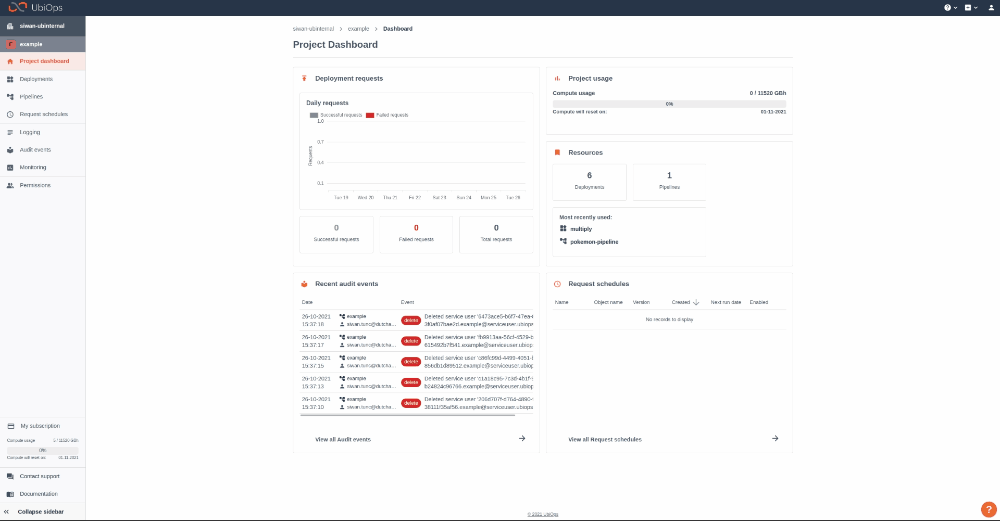

# Azure Data Factory integration

[Download notebook :fontawesome-solid-download:](https://download-github.ubiops.com/#!/home?url=https://github.com/UbiOps/tutorials/tree/master/azure-machine-learning/azure-machine-learning){ .md-button .md-button--primary } [View source code :fontawesome-brands-github: ](https://download-github.ubiops.com/#!/home?url=https://github.com/UbiOps/tutorials/tree/master/azure-machine-learning/azure-machine-learning){ .md-button .md-button--secondary }


In this example we will show you the following:

- How to create a pipeline in the UbiOps platform

- How to create an Azure Data Factory pipeline which interacts with a UbiOps pipeline


## The pipeline
| Deployment| Function |
|-----------|----------|
|data-preprocessor| Pre-process incoming csv file |
|knn-model | Predict if anyone has diabetes |

The pipeline will look like this:


With the following inputs and outputs:

| Model| Input| Output|
|------|------|------| 
|data-preprocessor | data: file,  training: file| cleaned_data: file, target_data: file  |
|knn-model | data: file, data_cleaning_artifact: file | prediction: file, prediction_diabetes_instances : integer |

## How does it work?

**Step 1:** Login to your UbiOps account at https://app.ubiops.com/ and create an API token with project editor
 rights. To do so, click on **Permissions** in the navigation panel, and then click on **API tokens**.
Click on **[+]Add token** to create a new token.



Give your new token a name, save the token in safe place and assign the following role to the token: project editor.
This role can be assigned on project level.

**Step 2:** Download the [azure-data-factory](https://download-github.ubiops.com/#!/home?url=https://github.com/UbiOps/tutorials/tree/master/azure-data-factory/azure-data-factory) folder and open *pipeline_creation.ipynb* in the *azure-data-factory* folder. In the notebook you will find a space
to enter your API token and the name of your project in UbiOps. Paste the saved API token in the notebook in the indicated spot
and enter the name of the project in your UbiOps environment. This project name can be found in the top of your screen in the
WebApp. In the image in step 1 the project name is *example*. Run the Jupyter notebook *pipeline_creation.ipynb* and the pipeline will be automatically deployed to your UbiOps environment!

**Step 3:** Now that we have the pipeline ready, we can switch to Azure Data Factory to set up another pipeline there.
Make sure that you have created an Azure Data Factory that you can use
in the following steps. If you do not already have a Data Factory set up, you can follow the steps in the short tutorial [here](https://docs.microsoft.com/en-us/azure/data-factory/quickstart-create-data-factory-portal#create-a-data-factory).

**Step 4**: Next, we will use the Azure Data Factory UI to create an ADF pipeline. One of the first things we will create in this pipeline is a linked service using
Azure Blob Storage. You can follow the steps [here](https://docs.microsoft.com/en-us/azure/data-factory/quickstart-create-data-factory-portal#create-a-data-factory) for a thorough explanation
of how to create a linked service.

**Step 5**: In one of the containers of the Blob Storage Account that you have used in the previous step, upload the CSV file *dummy_data_for_predicting.csv* which you can download 
from [dummy_data_for_predicting.csv](https://storage.googleapis.com/ubiops/data/Integration%20with%20cloud%20provider%20tools/azure-data-factory/dummy_data_for_predicting.csv). 

**Step 6**: On the Azure Data Factory UI page, open the Author tab from the left pane and create a dataset using as a data store the Azure Blob Storage. Choose *DelimitedText* as a format type of the data. Then, select the linked service created in step 4,
and finally select as a file path the path of the CSV file that you have uploaded in an earlier step. Tick the first row as header box and choose as an Import schema "From connection/store". Click OK.

**Step 7**: On the same page (ADF UI), go to the Activities tab, and from the *General* list select and drag the *Lookup* Activity. Click on this activity
and then go to the Settings Page. Select as a Source Dataset the dataset that we have created in step 6.

**Step 8**: In this step, you will need to have an Azure Function App set up. If you do not already have such an app, you can follow the steps 
described in [this](https://docs.microsoft.com/en-us/azure/azure-functions/functions-create-function-app-portal) tutorial.

**Step 9**: In the *function* folder, open the folder named *ubiops_request* and then the *__init__.py* file. In line 7 and 8, fill in the name of the pipeline that you are using for this tutorial (if you have created a pipeline using the notebook 
and you have not given it any custom name, you can leave the pipeline name as it is) and the name of the project in which this pipeline is located. Furthermore, in line number 22 fill in your token.
Once these lines have been changed, you can go ahead and deploy this Azure Function. Using the CLI, you can deploy this function using the command
```func azure functionapp publish <YOUR AZURE FUNCTION APP NAME>```. Make sure you are in the *function* folder while executing that command.

**Step 10**: Going back to the Azure Data Factory UI page, we can go the Author tab in the left pane, and then again to the Activities page. From the Azure Function drop list, select and drag to the pipeline the Azure Function Activity.
Connect the output of the Lookup Activity to the input of this Azure Function Activity.

**Step 11 (final step)**: Next, click on the Azure Function Activity and open the Settings page. Here, create a new Azure Function linked service. Give this new linked service a custom name, leave the integration runtime to "AutoResolveIntegrationRuntime" and choose as an Azure Function App Selection method the "From Azure Subscription" option.
Set the Azure Function App url to the url of the Function App to which you have deployed the Azure Function previously in step 9. Finally, fill in the function key of the deployed Azure Function. Click Create.
In the settings of the Azure Function Activity again, select POST as the method of the function. Also, set the Body to be the output of the Lookup Activity. In this way we can connect the 2 activities.

### Summary of the tutorial
At this point in the tutorial, the ADF pipeline has been successfully set up. It should read the data from the uploaded CSV via the lookup activity and pass this output to the Azure Function. The Azure Function will then call the UbiOps pipeline with this data. Finally, UbiOps will process the pipeline request and a set of predictions will be made.
The final pipeline should look like this.


To test that the pipeline works as it should, you can press the debug button. Both of the activities should succeed in this case.