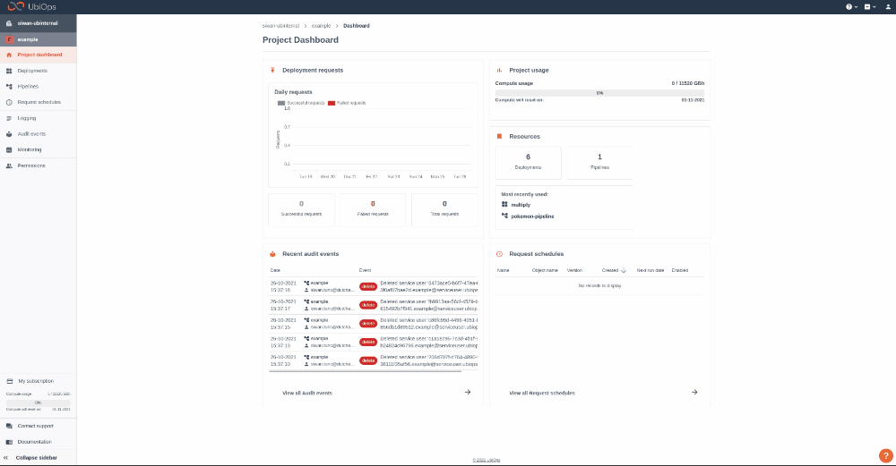

# How to connect UbiOps with Streamlit

[Download notebook :fontawesome-solid-download:](https://download-github.ubiops.com/#!/home?url=https://github.com/UbiOps/tutorials/tree/master/streamlit-tutorial/streamlit-tutorial){ .md-button .md-button--primary } [View source code :fontawesome-brands-github:](https://github.com/UbiOps/tutorials/blob/master/streamlit-tutorial/streamlit-tutorial/streamlit-tutorial.ipynb){ .md-button }

In this example we will show you the following:

How to turn the mnist deployment from the [image-recognition](https://ubiops.com/docs/ubiops_tutorials/ready-deployments/image-recognition/image-recognition/) ready deployment into a live web app using Streamlit.

## MNIST-Streamlit

The deployment is configured as follows:

| Deployment configuration | |
|-----|-----|
| Name | mnist-streamlit |
| Function | predict hand written digits |
| Input field | name: image, data_type: file |
| Output field | name = prediction, datatype = integer |
|              | name = probability, datatype = double precision
| Version name | v1 |
| Description | leave blank |
| Environment | Python 3.8 |

## How does it work?

**Step 1:** Login to your UbiOps account at https://app.ubiops.com/ and create an API token with project editor
 rights. To do so, click on **Permissions** in the navigation panel, and then click on **API tokens**.
Click on **[+]Add token** to create a new token.

Give your new token a name, save the token in a safe place and assign the following roles to the token: project editor. These roles can be assigned on project level.

**Note:** If you already have the [image-recognition](../ready-deployments/image-recognition/image-recognition.md) deployment in your UbiOps environment, you can skip step 2 and step 3.

**Step 2:** Download the *[mnist-streamlit](https://download-github.ubiops.com/#!/home?url=https://github.com/UbiOps/tutorials/tree/master/streamlit-tutorial/streamlit-tutorial){:target="_blank"}* folder and open *streamlit.ipynb*. In the notebook you will find a space to enter your API token and the name of your project in UbiOps. Paste the saved API token in the notebook in the indicated spot
and enter the name of the project in your UbiOps environment. This project name can be found in the top left of your screen in the
WebApp. In the GIF above the project name is example.

**Step 3:** Run the `streamlit.ipynb` file and the deployment will be automatically be deployed to your UbiOps environment

**Step 4** Open the `mnist-streamlit.py` and enter your project name and API token in the TODO fields. If you already had the mnist deployment in your UbiOps environment, change the deployment name to mnist.

**Step 5** Run *streamlit run `mnist-streamlit.py` and the web app will be created. 